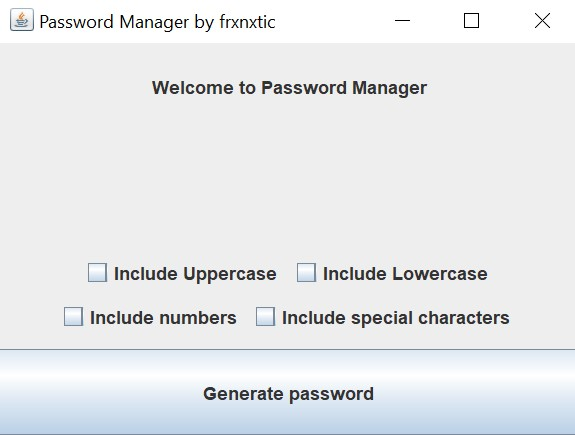

# Password Manager

The Password Manager project is a desktop application that helps users securely store and manage their passwords. The application includes encryption, strong password generation and automatic password insertion in the required fields.

## Possibilities

- Encryption and decryption of passwords
- Strong password generation with customizable options
- Automatic insertion of the password in the required fields
- Secure password storage using a private key
- Intuitive and user interface

## Technologies

- Programming language: Java
- GUI: Swing
- Password encryption: AES (Advanced Encryption Standard), SHA-256
- Build system: Maven

## Installation and launch

1. Clone the repository to your local device:

<pre><code>git clone https://github.com/frxnxtic/PasswordManager.git</code>></pre>

2. Open the project in your favorite Java IDE (such as IntelliJ IDEA or Eclipse).

3. Install the project dependencies by running the following command in the project root directory:

<pre><code>mvn install</code></pre>

4. Run the application by executing the `main` method in the `Main` class.

## Contribution

You can contribute to the project by following these steps:

1. Create a new branch for your functionality:

<pre><code>git checkout -b feature/new-feature</code></pre>

2. Make the necessary changes and add them:

<pre><code>git add .</code></pre>

3. Commit the changes:

<pre><code>git commit -m "Add new feature"</code></pre>

4. Push commits to the remote branch:

<pre><code>git push origin feature/new-feature</code></pre>

5. Open a Pull Request on GitHub.