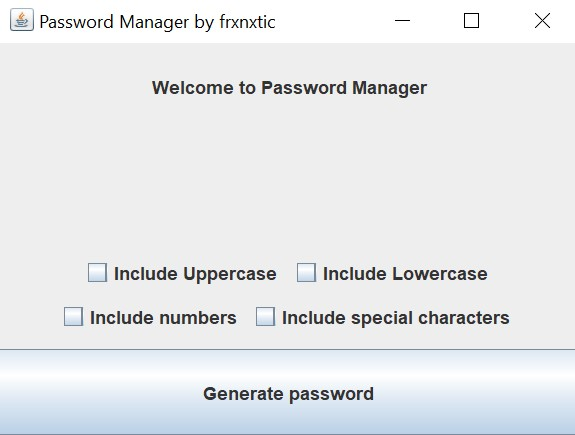

# Password Manager

Проект Password Manager представляет собой десктопное приложение, которое помогает пользователям безопасно хранить и управлять своими паролями. Приложение включает функции шифрования, генерации сильных паролей и автоматической вставки пароля в нужные поля.

## Возможности

- Шифрование и дешифрование паролей
- Генерация сильных паролей с настраиваемыми параметрами
- Автоматическая вставка пароля в нужные поля
- Безопасное хранение паролей с использованием секретного ключа
- Интуитивно понятный и пользовательский интерфейс

## Технологии

- Язык программирования: Java
- Графический интерфейс: Swing
- Шифрование паролей: AES (Advanced Encryption Standard), SHA-256
- Система сборки: Maven

## Установка и запуск

1. Клонируйте репозиторий на ваше локальное устройство:

<pre><code>git clone https://github.com/frxnxtic/PasswordManager.git</code>></pre>

2. Откройте проект в вашей любимой интегрированной среде разработки Java (например, IntelliJ IDEA или Eclipse).

3. Установите зависимости проекта, выполнив следующую команду в корневой директории проекта:

<pre><code>mvn install</code></pre>

4. Запустите приложение, выполнив метод `main` в классе `Main`.

## Вклад

Вы можете внести свой вклад в проект, выполнив следующие шаги:

1. Создайте новую ветку для своей функциональности:

<pre><code>git checkout -b feature/new-feature</code></pre>

2. Внесите необходимые изменения и добавьте их:

<pre><code>git add .</code></pre>

3. Сделайте коммит изменений:

<pre><code>git commit -m "Add new feature"</code></pre>

4. Отправьте коммиты в удаленную ветку:

<pre><code>git push origin feature/new-feature</code></pre>

5. Откройте запрос на слияние (Pull Request) на GitHub.

